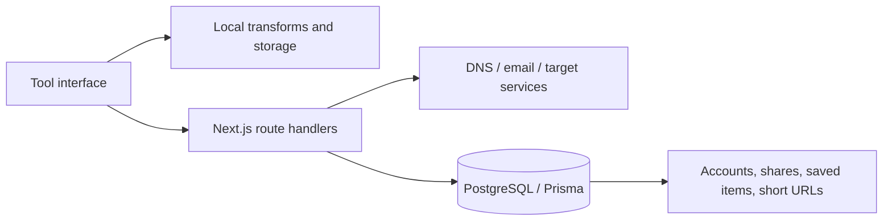

# DevTools

**A fast toolbox for formatting, generating, testing, and inspecting developer data.**

[](https://github.com/montasim/devtools/actions/workflows/ci.yml)
[](https://devtoolsn.vercel.app)
[](LICENSE)
[](https://www.supportkori.com/montasim)

DevTools puts more than 50 everyday utilities behind one searchable interface:
JSON and text transforms, encoders, generators, network diagnostics, security
inspectors, and reference tables. Most transformations run locally in the
browser, while account sync, saved shares, short links, webhooks, and selected
network checks use server-side APIs.

**[Open DevTools](https://devtoolsn.vercel.app)** · Press `Ctrl+K` or `Cmd+K`
inside the app to jump directly to a tool.

## Tool collection

| Area | Included workflows |
| --- | --- |
| Structured data | JSON, XML, SVG, HTML, CSS, SQL, YAML, and CSV formatting or transformation |
| Text and encoding | Text cleanup and diff, Base64, URL encoding, HTML entities, cURL conversion, fancy/leet text, and text art |
| Generators | UUID/ULID/NanoID, hashes, bcrypt/Argon2, RSA keys, passwords, passphrases, QR codes, sample data, and Git branch names |
| Network and APIs | Request builder, header parser, WebSocket tester, CORS checker, DNS lookup, STUN/TURN checks, webhook inbox, certificate decoding, and IP/CIDR tools |
| References | Regex, HTTP status, MIME and Content-Type, Unicode, ASCII, emoji, time zones, and cron expressions |
| Browser utilities | Markdown preview, color and unit conversion, web playground, email-domain checks, spam-word checks, and RSS analysis |

The navigation registry in [`config/navigation.tsx`](config/navigation.tsx) is
the source of truth for the current catalog.

## Privacy boundary

“Browser-based” does not mean every feature is offline. The boundary is:

- Formatters, encoders, generators, parsers, and most reference tools process
  their current input in the browser.
- API, WebSocket, DNS, CORS, IP, STUN/TURN, email-domain, leaked-password, RSS,
  and webhook utilities necessarily contact the selected target or a server
  endpoint.
- Creating a share link, saved item, account, or shortened URL stores the
  submitted state in PostgreSQL. Password-protected shares store a password
  hash, but their content is still held server-side.
- Tool history and preferences that use local storage remain on that browser
  unless the user explicitly invokes an account-backed feature.

Do not paste credentials, production private keys, personal data, or classified
content into a networked workflow. Inspect the destination before sending an
API or WebSocket request.

## Platform features

- Command palette and global right-click menu for navigation and actions
- Local input history and reusable saved state
- Optional email-OTP accounts with cross-device saved items
- Expiring and optionally password-protected share links
- URL shortening with click tracking
- Webhook request capture and inspection
- Light/dark themes and responsive layouts
- Keyboard-accessible tool tabs and controls

## Run locally

### Requirements

- Node.js 24.12.0, matching [`.nvmrc`](.nvmrc)
- pnpm 10, matching the CI workflow
- PostgreSQL for authentication, shares, saved items, and short URLs

```bash
git clone https://github.com/montasim/devtools.git
cd devtools
nvm use
pnpm install
cp .env.example .env
pnpm exec prisma generate
pnpm exec prisma db push
pnpm dev
```

Open <http://localhost:3000>.

`prisma db push` changes the configured database schema. Point
`DATABASE_URL` at a disposable development database first; use reviewed Prisma
migrations rather than schema push for production change management.

### Active configuration

The application code currently reads these settings:

| Variable | Required for | Purpose |
| --- | --- | --- |
| `DATABASE_URL` | Server-backed features | PostgreSQL connection used by Prisma |
| `BETTER_AUTH_SECRET` | Authentication | Better Auth signing secret; falls back to `JWT_SECRET` |
| `BETTER_AUTH_URL` | Authentication | Canonical auth origin; falls back to `BASE_URL` |
| `OTP_HMAC_SECRET` | Email OTP | HMAC secret used for OTP handling |
| `RESEND_API_KEY` | Email OTP | Resend API key; without it, email delivery is skipped |
| `FROM_EMAIL` | Email OTP | Verified sender address |
| `NEXT_PUBLIC_APP_URL` | Browser links | Public origin for auth and generated short URLs |

Replace every placeholder with a development-safe value and never commit the
result. [`.env.example`](.env.example) also contains infrastructure notes and
reserved settings; the table above is intentionally limited to variables
referenced by the current application.

## Commands

| Command | Purpose |
| --- | --- |
| `pnpm dev` | Start the Next.js development server |
| `pnpm build` | Generate Prisma Client and create a production build |
| `pnpm start` | Serve the production build |
| `pnpm lint` | Run ESLint |
| `pnpm typecheck` | Check TypeScript without emitting files |
| `pnpm test --run` | Run the Vitest suite once |
| `pnpm format:check` | Check Prettier formatting |
| `pnpm format` | Rewrite files with Prettier |

The GitHub Actions workflow runs dependency installation, lint, TypeScript,
and the production build for pushes and pull requests targeting `main`.

## Architecture



```text
app/(tools)/           Tool pages and route-level metadata
features/tools/        Individual tools, tabs, hooks, data, and utilities
features/auth/         Account-facing hooks and components
app/api/               Auth, DNS, saved, share, URL, and webhook endpoints
config/navigation.tsx  Searchable tool catalog and navigation
lib/                   Auth, Prisma, API client, storage, and shared helpers
prisma/schema.prisma   Server-backed data model
```

## Deployment

The maintained deployment runs at
[devtoolsn.vercel.app](https://devtoolsn.vercel.app). A self-hosted deployment
needs a PostgreSQL database and production values for the active configuration
above. Use HTTPS for auth and shared-content flows, set the canonical public
origin consistently, and apply the Prisma schema before serving traffic.

## Limitations

- Browser security policies can block cross-origin API checks even when the
  target works from a server or CLI.
- DNS, IP reputation, disposable-email, and similar third-party information can
  be incomplete or stale.
- Cryptographic utilities are convenience tools, not a substitute for a
  reviewed key-management or password-storage design.
- Share and URL-shortener availability depends on the deployment and database;
  local-only utilities remain useful without an account.

## Contributing and security

Open a focused issue or pull request with reproduction steps, screenshots when
useful, and the checks you ran. New tools should declare whether input stays in
the browser, contacts a third party, or is persisted server-side.

Report vulnerabilities privately through the contact links on
[the maintainer's GitHub profile](https://github.com/montasim), not in a public
issue. Never include real secrets or user-submitted share content in reports.

Optional support through [SupportKori](https://www.supportkori.com/montasim)
helps fund hosting and maintenance.

## License

Licensed under the [MIT License](LICENSE).

## Maintainer

[Mohammad Montasim Al Mamun Shuvo](https://github.com/montasim)
